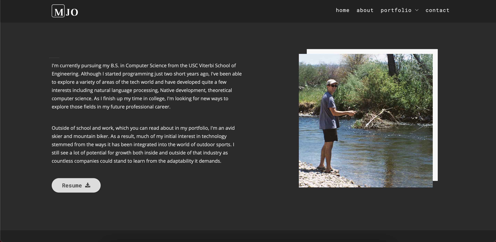
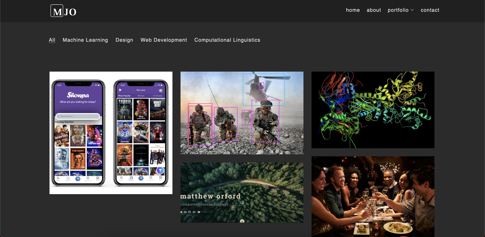
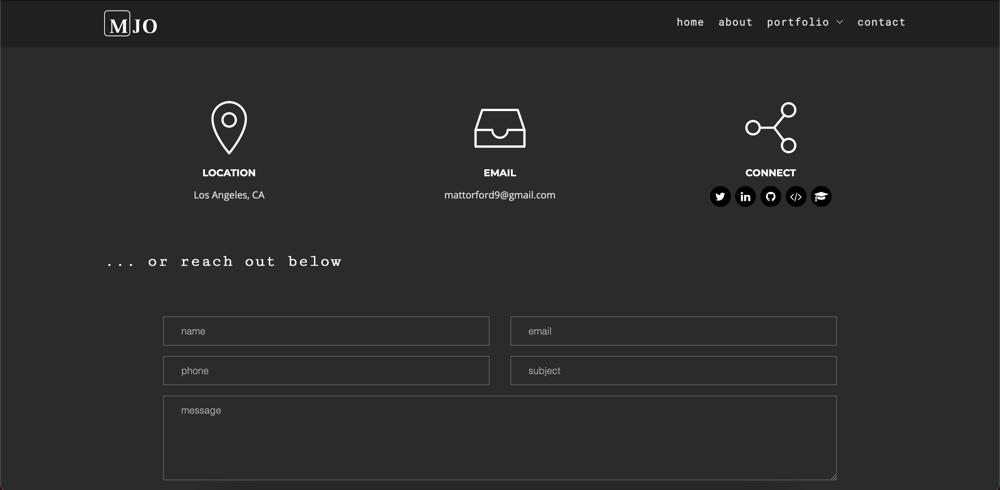

# My Portfolio Website

This respository contains the code behind my portfolio website. This website is one I made to display my work and practice my web development skills. I recently migrated this code from a pure HTML5 website to a React.js-based one.

## Link

[mattheworford.com](https://mattheworford.com)

## Technologies

- React.js
- HTML5
- CSS
- JavaScript

## Preview

